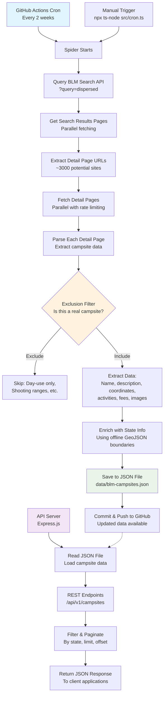

# BLM Spider

Scrape and serve Bureau of Land Management (BLM) dispersed campsite data as a modern API. This project crawls the BLM website, parses each campsite detail page, and saves structured data to a JSON file. A GitHub Actions cron job runs the spider automatically every two weeks. The API allows you to query and filter campsite data. The crawler is optimized for reliability and efficiency with retry logic, connection reuse, and parallel detail page fetching. It also infers missing state information using offline geospatial boundaries—no external API calls required.

---

## Features
- **Automated spider**: Crawls and extracts BLM campsite data on a schedule or on demand.
- **Scheduled updates:** A GitHub Actions cron job runs the crawler biweekly to keep data fresh.
- **REST API**: Query, filter, and update campsites via HTTP endpoints.
- **JSON storage**: All data is stored in `data/blm-campsites.json`.
- **Image scraping**: Scrapes official BLM photos with credit and alt text when available.
- **Geolocation enrichment:** Automatically infers the U.S. state from coordinates using @turf/turf and a local GeoJSON file
- **Exclusion logic**: Filters out irrelevant locations like day use areas or shooting ranges.

---

## How It Works



---

## Live Deployment

- **API Base URL:** [`https://blm-spider.onrender.com/api/v1`](https://blm-spider-api.onrender.com/api/v1)
- **Swagger Docs:** [`https://blm-spider.onrender.com/docs`](https://blm-spider-api.onrender.com/docs)

---

## Getting Started

### Install dependencies
```sh
npm install
```

### Run the API server
```sh
npm start
```
The server will start on `http://localhost:8080` by default.

### Run the spider manually
```sh
npx ts-node src/cron.ts
```
This will crawl the BLM site and update `data/blm-campsites.json`.

### Schedule automatic updates
A cron job is set up in `src/cron.ts` to run every 2 weeks. You can also use the included GitHub Actions workflow (`.github/workflows/scrape.yml`) to keep your data fresh in the cloud.

---

## API Documentation

### Base URL
```
http://localhost:3000/api/v1
```

### Endpoints

#### `GET /campsites`
Retrieve all campsites, with optional filtering and pagination.

**Query Parameters:**
- `state` (string, optional): Filter by state (case-insensitive)
- `limit` (integer, optional): Limit the number of results
- `offset` (integer, optional): Offset for pagination

**Example:**
```
GET /api/v1/campsites?state=Colorado&limit=10&offset=0
```

**Response:**
```json
[
  {
    "id": "...",
    "name": "...",
    "url": "...",
    "description": "...",
    "lat": 0,
    "lng": 0,
    "state": "Colorado",
    "directions": "...",
    "activities": ["camping", "hiking"],
    "campgrounds": ["Main Campground"],
    "wildlife": ["deer", "eagle"],
    "fees": "$10/night",
    "stayLimit": "14 days",
    "images": [{"src": "img.com", "alt": "caption", "credit": "credit"}],
    "source": "BLM",
  },
  // ...
]
```

---

#### `GET /campsites/{id}`
Retrieve a single campsite by its unique ID.

**Example:**
```
GET /api/v1/campsites/123e4567-e89b-12d3-a456-426614174000
```

**Response:**
```json
{
  "id": "123e4567-e89b-12d3-a456-426614174000",
  "name": "...",
  "url": "...",
  "description": "...",
  "lat": 0,
  "lng": 0,
  "state": "Colorado",
  "directions": "...",
  "activities": ["camping", "hiking"],
  "campgrounds": ["Main Campground"],
  "wildlife": ["deer", "eagle"],
  "fees": "$10/night",
  "stayLimit": "14 days",
  "images": [{"src": "img.com", "alt": "caption", "credit": "credit"}],
  "source": "BLM",
}
```
---

## Data Model

See [`src/types.ts`](src/types.ts) for the full `Campsite` interface. Key fields:

- `id`, `name`, `url`, `description`, `lat`, `lng`, `state`, `source`
- (optional) `directions`, `activities`, `campgrounds`, `wildlife`, `fees`, `stayLimit`, `images`
