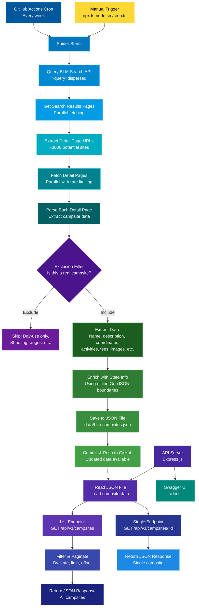

# BLM Spider

This project provides an API for discovering Bureau of Land Management (BLM) campsites across the United States. It combines a custom spider, scheduled automation, and a Node.js server to deliver location data via the /campsites and /campsites/{id} endpoints. A GitHub Actions workflow runs the spider automatically each week, ensuring that the data remains current.

The spider regularly scans the BLM website, extracts and filters campsite detail pages, and saves the results to a structured JSON dataset. It’s optimized using parallel fetching, persistent connections, retry logic, and in-memory exclusion rules. Geospatial enrichment is performed entirely offline—inferring U.S. state boundaries from coordinates using Turf.js and a local GeoJSON file.

Whether you're building a camping app, visualizing public land usage, or exploring the outdoors, this project offers a fast, lightweight foundation for accessing and working with BLM campsite data.

**Disclaimer:** This dataset is generated through automated scraping and filtering. While best efforts are made to exclude non-campsites (e.g., day-use areas, shooting ranges), accuracy is not guaranteed. Always confirm a site’s legal status and accessibility with the BLM before visiting.

---

## Live Deployment

- **API Base URL:** [`https://blm-spider.onrender.com/api/v1`](https://blm-spider.onrender.com/api/v1)
- **Swagger Docs:** [`https://blm-spider.onrender.com/docs`](https://blm-spider.onrender.com/docs)

---

## Features

- **High-performance:** Uses parallel fetching, persistent connections, and retry logic for fast, reliable crawling. In-memory filtering reduces noise, and geospatial enrichment is done offline for speed and privacy.
- **Automated**: Crawls and extracts BLM campsite data on a schedule or on demand.
- **Scheduled updates:** A GitHub Actions cron job runs the crawler biweekly to keep data fresh.
- **REST API**: Query, filter, and update campsites via HTTP endpoints.
- **JSON storage**: All data is stored in `data/blm-campsites.json`.
- **Image scraping**: Scrapes official BLM photos with credit and alt text when available.
- **Geolocation enrichment:** Automatically infers the U.S. state from coordinates using @turf/turf and a local GeoJSON file
- **Exclusion logic**: Filters out irrelevant locations like day use areas or shooting ranges.

---

## How It Works

- The spider crawls the BLM website, parses each campsite detail page, and saves structured data to a JSON file.
- A GitHub Actions cron job runs the spider automatically every week to keep data fresh.
- The API reads from the generated JSON file and serves endpoints for querying and filtering campsite data.
- Geospatial enrichment (state inference) is performed offline using Turf.js and a local GeoJSON file—no external API calls required.
- The API supports filtering, pagination, and returns structured JSON responses.



---

## Data Model

```typescript
interface Campsite {
  id: string;
  name: string;
  url: string;
  lat: number;
  lng: number;
  state: string;
  mapLink: string;
  description?: string;
  directions?: string;
  activities?: string[];
  campgrounds?: string[];
  wildlife?: string[];
  fees?: string;
  stayLimit?: string;
  images?: CampsiteImage[];
  source: 'BLM';
}

interface CampsiteImage {
  src: string;
  alt?: string;
  credit?: string;
}
```

## API Documentation

### Base URL
```
http://localhost:3000/api/v1
```

### Endpoints

#### `GET /campsites`
Retrieve all campsites, with optional filtering and pagination.

**Query Parameters:**
- `state` (string, optional): Filter by state (case-insensitive)
- `activites` (string, optional): Filter by a list of activities
- `limit` (integer, optional): Limit the number of results
- `offset` (integer, optional): Offset for pagination

**Example:**
```
GET /api/v1/campsites?state=Colorado&activities=camping&limit=10&offset=0
```

**Response:**
```json
[
  {
    "id": "28430a4f-ce40-478d-a7b1-0c23d9c49dbb",
    "name": "Middle Fork of the Powder River Campground",
    "url": "https://www.blm.gov/visit/middle-fork-powder-river-campground-0",
    "description": "Astride a blue-ribbon trout stream, this remote and picturesque campground features five camping sites with fire rings, restroom and drinking water. Use of the area is free with a 14-day limit on camping (as on all public lands). The Middle Fork of the Powder River Campground, located at an elevation of 7,500 feet, is open from May through September.",
    "lat": 43.579304,
    "lng": -107.140476,
    "state": "Wyoming",
    "mapLink": "https://www.openstreetmap.org/export/embed.html?bbox=-107.15047600000001,43.569304,-107.130476,43.589304&layer=mapnik&marker=43.579304,-107.140476",
    "directions": "From Ten Sleep, the area is reached by driving 20 miles south on State Highway 434 to Big Trails. From there turn left on the graveled Dry Farm Road and drive about 13 miles to the Hazelton Road. Turn right and drive about 17 miles to the campground. For other routes to the campground, check with the BLM offices in Worland, Buffalo, or Casper.",
    "activities": [
      "CAMPING"
    ],
    "source": "BLM"
  },
  ...
]
```

---

#### `GET /campsites/{id}`
Retrieve a single campsite by its unique ID.

**Example:**
```
GET /api/v1/campsites/5a1e40b5-4aec-4624-94e0-6f9e757a61de
```

**Response:**
```json
{
    "id": "5a1e40b5-4aec-4624-94e0-6f9e757a61de",
    "name": "Valley of the Giants Outstanding Natural Area",
    "url": "https://www.blm.gov/visit/valley-giants-outstanding-natural-area",
    "description": "Some of the largest Douglas firs and Western Hemlocks in the Oregon Coast Range can be found in the Bureau of Land Management’s Valley of the Giants. Many of these trees are twenty feet in circumference, 200 feet tall, and 400 to 450 years old. Though a windstorm blew it down in 1981, the largest reached a circumference of thirty-five feet and was approximately 600 years old. Believed to be the second-largest Douglas fir in Oregon, the tree was called “Big Guy”. In the 1970s, public concern grew over the increasing rarity of exceptionally large trees.",
    "lat": 44.936289,
    "lng": -123.715592,
    "state": "Oregon",
    "mapLink": "https://www.openstreetmap.org/export/embed.html?bbox=-123.725592,44.926289000000004,-123.705592,44.946289&layer=mapnik&marker=44.936289,-123.715592",
    "directions": "Visitors should contact the Northwest Oregon District Office for directions and current conditions. Route closed when public fire restrictions are in effect. Fire Restrictions - Oregon-Washington Bureau of Land Management (blm.gov) Oregon Department of Forestry Public Fire Restrictions",
    "fees": "No fees.",
    "images": [
      {
        "src": "https://cdn.recreation.gov/public/2020/06/09/21/21/10057631_a27238fc-a182-4009-84dc-9955a7e1433e.jpeg",
        "alt": "Tall trees on display in the Valley of the Giants.",
        "credit": "Bureau of Land Management"
      },
      {
        "src": "https://cdn.recreation.gov/public/2020/06/09/21/21/10057631_25633784-8c26-448b-8c03-effe44554984.jpeg",
        "alt": "A child hugs a tree in the Valley of the Giants.",
        "credit": "Bureau of Land Management"
      },
      {
        "src": "https://cdn.recreation.gov/public/2020/06/09/21/21/10057631_13fbb1f3-e81d-400c-adf4-338efd18a462.jpeg",
        "alt": "View of massive trees in a forested setting.",
        "credit": "Bureau of Land Management"
      }
    ],
    "source": "BLM"
  }
```
---

## Getting Started

### Install dependencies
```sh
npm install
```

### Run the API server
```sh
npm start
```
The server will start on `http://localhost:8080` by default.

### Run the spider manually
```sh
npx ts-node src/cron.ts
```
This will crawl the BLM site and update `data/blm-campsites.json`.

### Schedule automatic updates
A cron job is set up in `src/cron.ts` to run every week. 

---

## Docker

You can run the BLM Spider API in a Docker container for easy deployment and isolation.

### Build the Docker image

```sh
docker build -t blm-spider .
```

### Run the API server with Docker

```sh
docker run --rm -p 8080:8080 blm-spider
```

or using Docker Compose:

```sh
docker-compose up --build
```

The API will be available at http://localhost:8080.